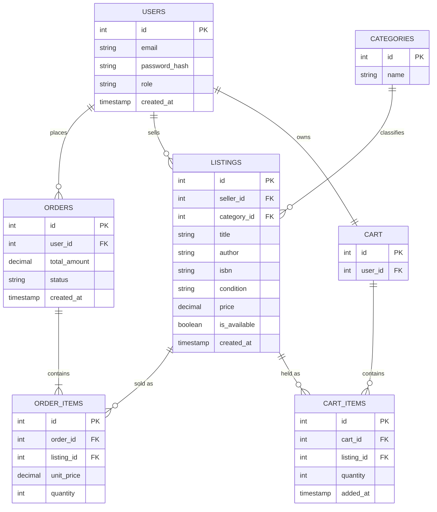

# Sprint 1: System Architecture & Scope Definition
**Project:** BookNook — A Marketplace for Independent & Used Bookstores
**Course:** E-Commerce
**Sprint:** 1 — Architecture & Domain Modeling

---

## Section 1: Target Audience & Market Focus

**Primary Persona:**
Independent and secondhand bookstore owners (typically 1–5 employees) who currently sell only in-store or through inconsistent, fee-heavy third-party channels (e.g., generic marketplace listings), alongside book-buying consumers who specifically want to browse curated, used, or rare inventory rather than new mass-market titles from a large retailer.

**Core Pain Point:**
Small bookstores lack affordable, easy-to-manage online storefronts. Existing e-commerce platforms are either too generic (not built for single-copy, condition-variable inventory like used books) or too expensive/complex for a small shop to configure and maintain. Buyers who want used or rare books have no single place to search across multiple independent stores at once.

**Domain Scope:**
Vertical marketplace for **used, rare, and independently-sold books** — a sub-vertical of Digital/Physical Retail Goods, distinguished from general retail by *single-quantity, condition-graded inventory* (e.g., "Good," "Very Good," "Like New") rather than standard SKU-based stock.

---

## Section 2: MVP Feature Scope

| Category | Feature Name | Description | Priority |
|---|---|---|---|
| Authentication | User Registration & Authentication | Password hashing (bcrypt) and JWT-based auth, with a distinct `role` claim separating `buyer` and `seller` (store owner) accounts. | High (MVP) |
| Catalog | Listing Creation & Search | Sellers create individual book listings (title, author, ISBN, condition, price). Buyers search/filter by title, author, category, and condition. | High (MVP) |
| Cart | Cart Management | Persistent, session-independent cart supporting items from multiple sellers; add/update/remove line items. | High (MVP) |
| Checkout | Order Processing | Stripe (test mode) payment integration; on success, instantiates an `Order` and associated `Order_Items`, and decrements listing availability. | High (MVP) |
| Seller Tools | Store Inventory Control | CRUD interface scoped to the authenticated seller's own listings only (ownership-checked at the API layer). | Medium |
| Catalog | Category Browsing | Browse listings by fixed category taxonomy (Fiction, Non-Fiction, Rare/Collectible, Textbook, etc.). | Medium |

**Feasibility note:** Six workflows, all built on a single relational schema with no external inventory sync or multi-warehouse logic — scoped intentionally to fit a single academic semester.

---

## Section 3: Tech Stack Selection & Justification

**Frontend Framework: Next.js (React)**
Justification: Server-side rendering benefits SEO for individual listing pages (buyers frequently arrive via search engines looking for a specific out-of-print title), while React's component model keeps cart/catalog state manageable. Chosen over plain Vue.js primarily for the built-in routing and SSR without extra tooling.

**Backend Infrastructure: FastAPI (Python)**
Justification: Async request handling suits I/O-bound operations like Stripe webhook calls and search queries; automatic OpenAPI schema generation speeds up frontend/backend contract work for a small team. Chosen over Django for lighter weight, since the project doesn't need Django's built-in admin/templating stack.

**Database Management System: PostgreSQL**
Justification: The domain is inherently relational — orders, order items, and cart items all depend on strict foreign-key integrity and multi-table joins (e.g., "all order items for a given seller's listings"). PostgreSQL's constraint enforcement is preferred over a NoSQL document store like MongoDB, where join-heavy queries and referential integrity would have to be re-implemented in application code.

**Caching & Asynchronous Processing (Optional): Redis**
Justification: Used for session-based cart persistence for guest (non-authenticated) users before checkout, and as a lightweight task queue trigger for order-confirmation emails, avoiding a blocking call during the checkout request.

---

## Section 4: Entity-Relationship Diagram (ERD)

### Cardinality Summary
- **USERS 1 : N ORDERS** — one user places many orders.
- **USERS 1 : N LISTINGS** — one seller (a user with `role = seller`) owns many listings.
- **USERS 1 : 1 CART**, **CART 1 : N CART_ITEMS** — each user has exactly one cart, holding many cart items.
- **ORDERS 1 : N ORDER_ITEMS** — one order contains many order items.
- **LISTINGS 1 : N ORDER_ITEMS**, **LISTINGS 1 : N CART_ITEMS** — a listing can appear in many historical order items but (since inventory is single-copy) only one *active* cart item at a time — enforced at the application layer, not the schema.
- **CATEGORIES 1 : N LISTINGS** — one category classifies many listings.

**Design notes for the write-up (worth restating in your own words for grading):**
- `CART` is split from `USERS` as its own entity (rather than a `cart_id` column on `USERS`) so cart lifecycle — creation, clearing after checkout — is independent of the user record.
- `unit_price` is duplicated onto `ORDER_ITEMS` rather than always joining back to `LISTINGS.price`, since a listing's price can change or the listing can later be deleted, but historical orders must retain the price actually paid.
- `is_available` on `LISTINGS` models single-copy inventory (no `stock_quantity` int, since used books are typically one-of-a-kind).
